#### 第七课 temporal-difference learning

这节课算法看着挺多，但都是同一个模板的不同变形。

1.state value

用TD算法计算给定策略的state value
$$
这里v_t(s) 代表t时刻对v_{\pi}(s)的估计值,s_t代表t时刻访问到的数据的state
$$
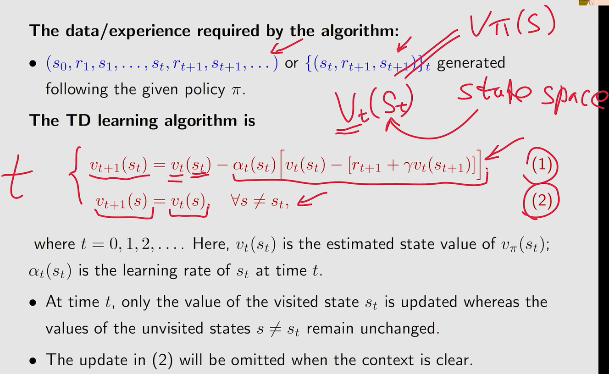

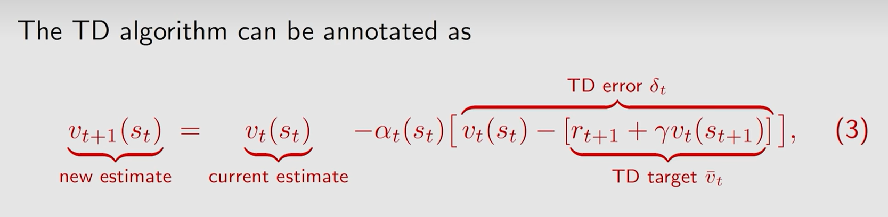

bellman equation的数学期望形式
$$
TD算法可以看作用RM求解bellman\ equation，只不过其中v_{\pi}(S\prime)用v_t(s_{t+1})近似表示
$$
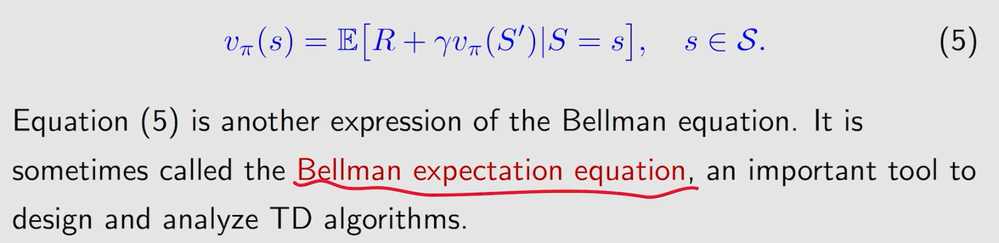

使用TD算法对系数的约束条件

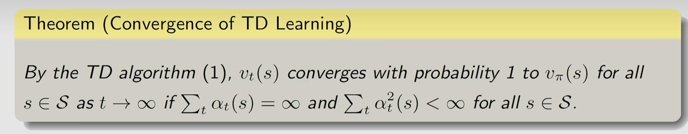

比较

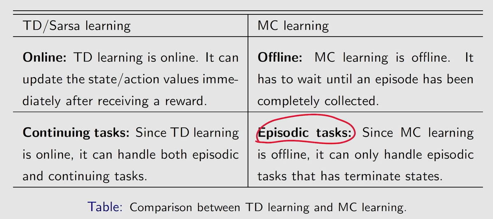

虽然TD的方差小，但TD会有bias

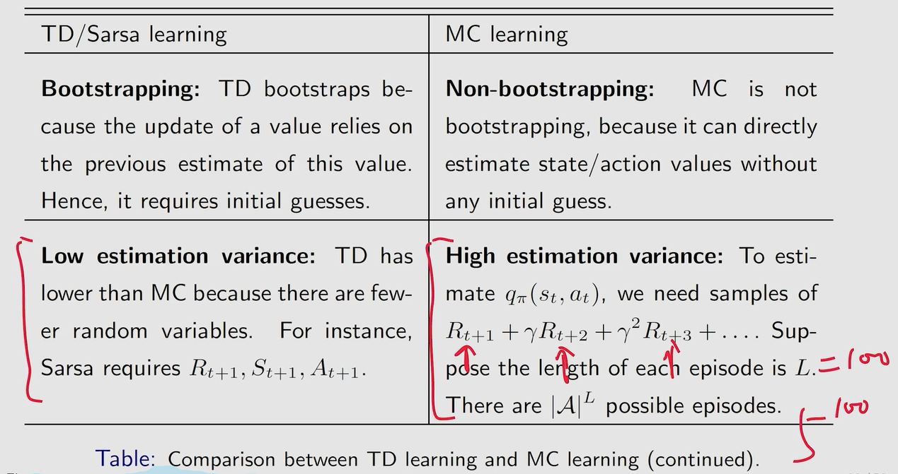

2.Sarsa(estimate action value)

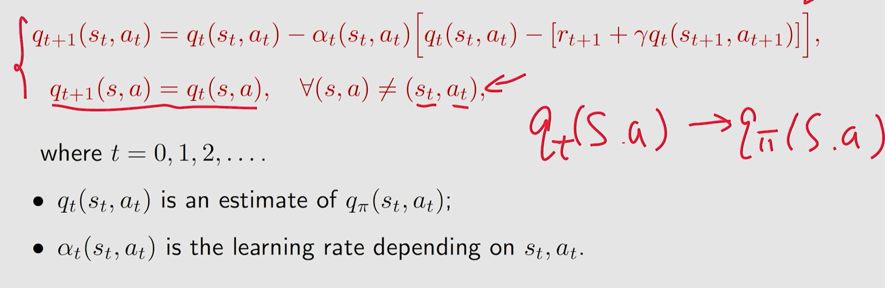

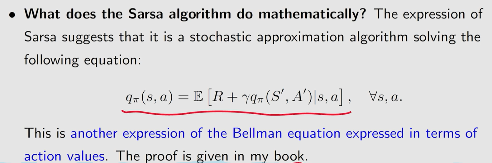

Sarsa+policy improvement寻找最优策略

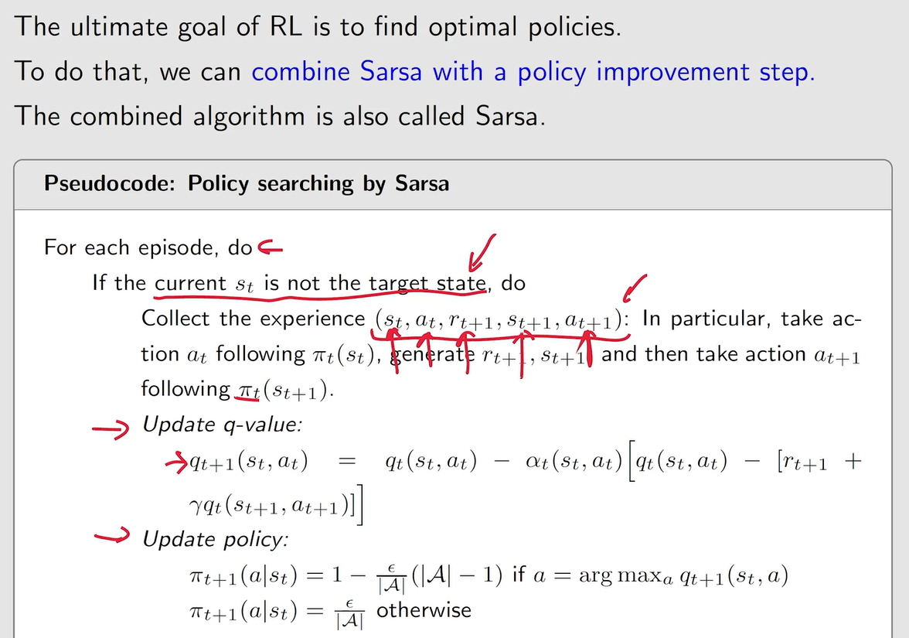

注，若只关心从某一点出发到达目标点的最优路径，此时就可以不需要算出全局所有点的value，每次的episode采样都从出发点开始即可。

3.expected Sarsa

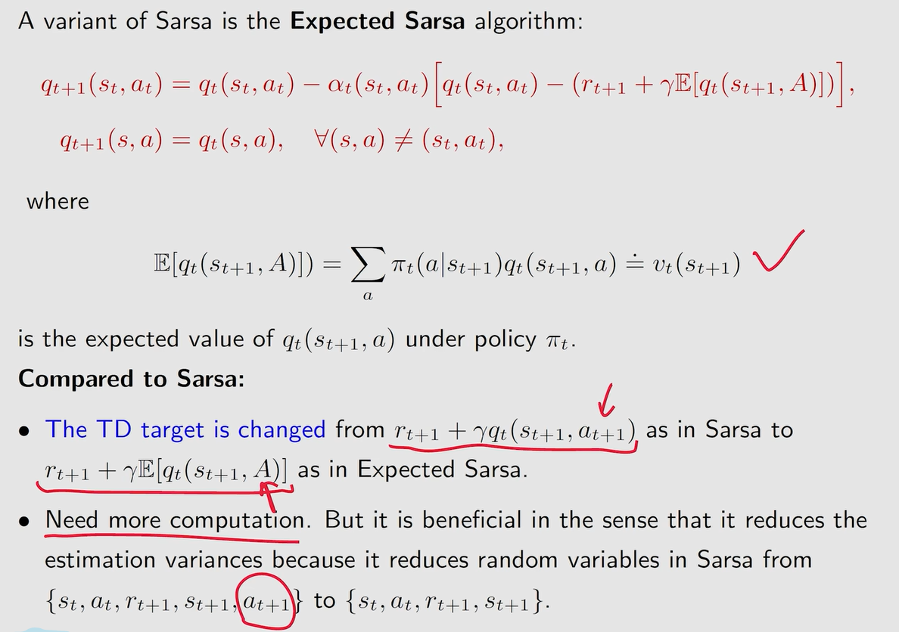

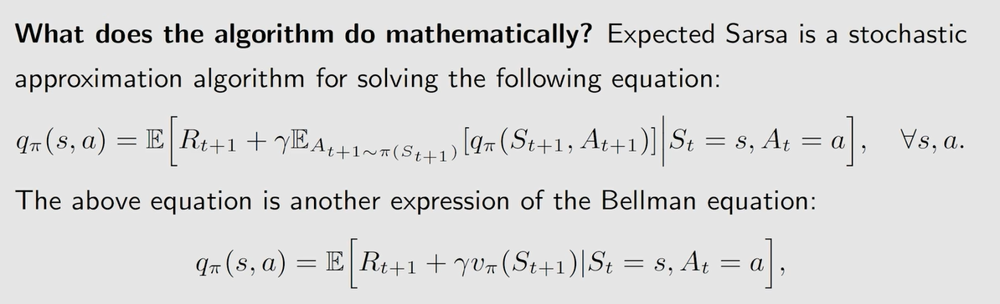

4.n-step Sarsa

unify Sarsa and Monte Carlo

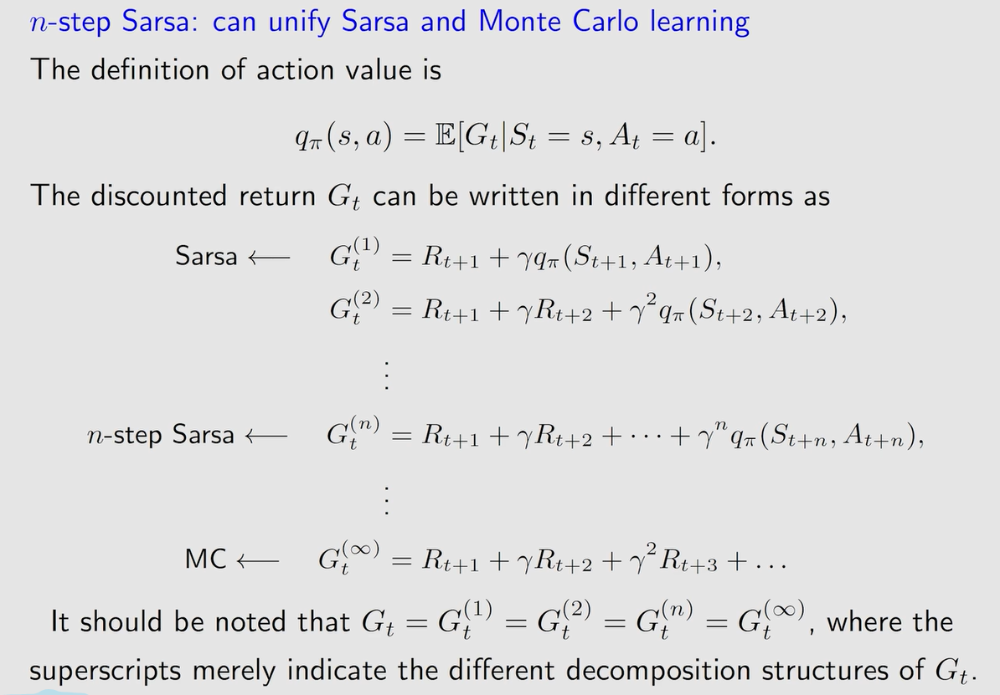

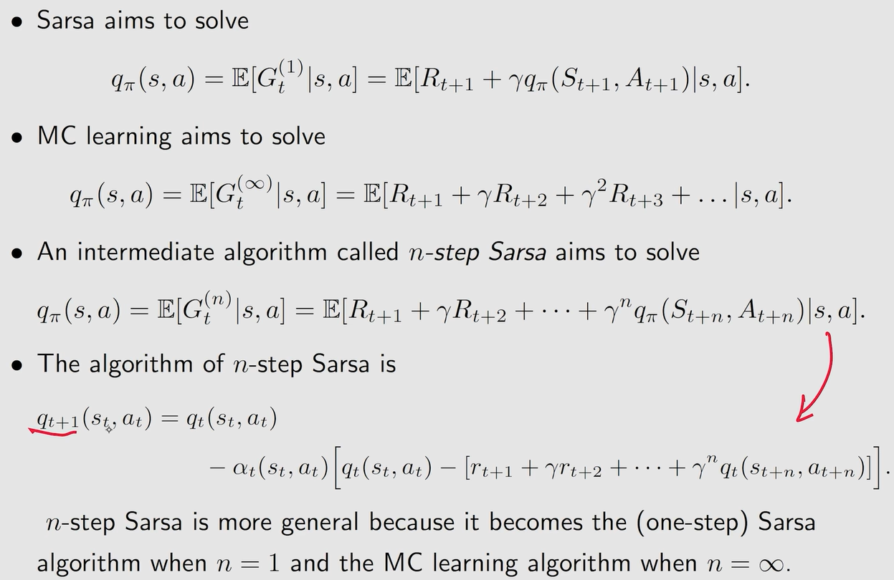

5.Q-learning(optimal action value)

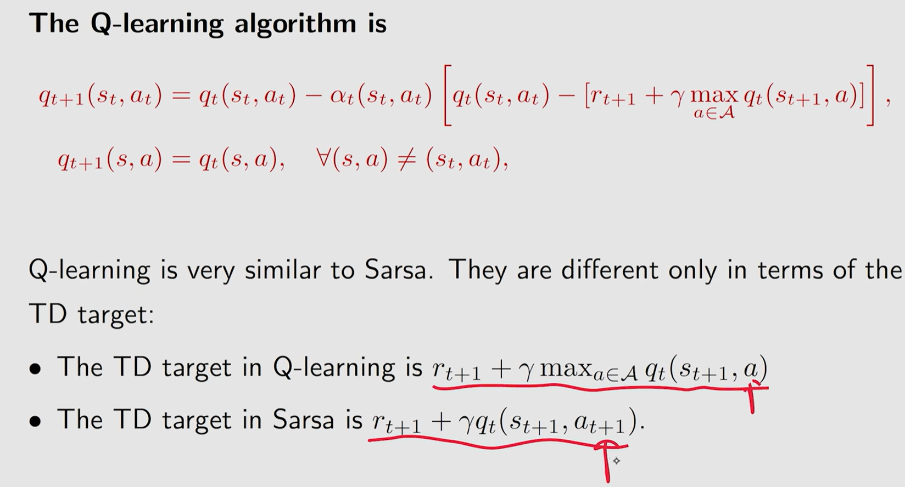

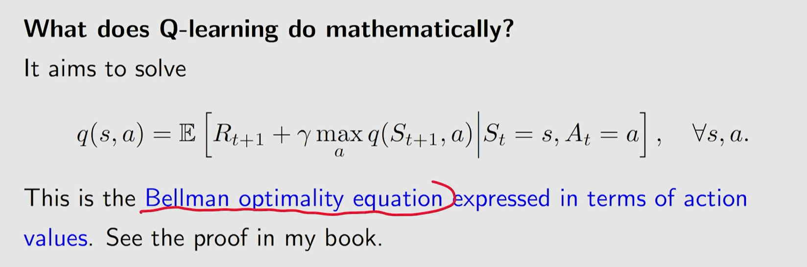

on/off policy

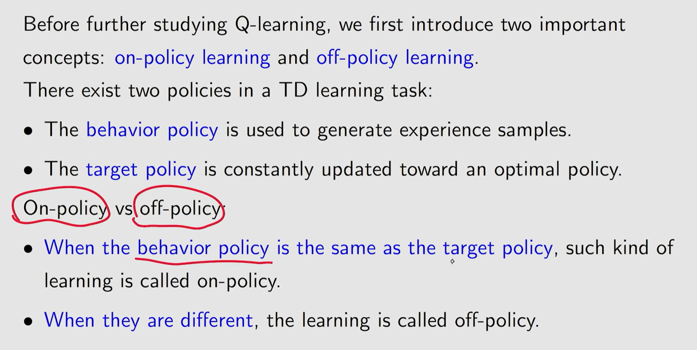

6.conclusion

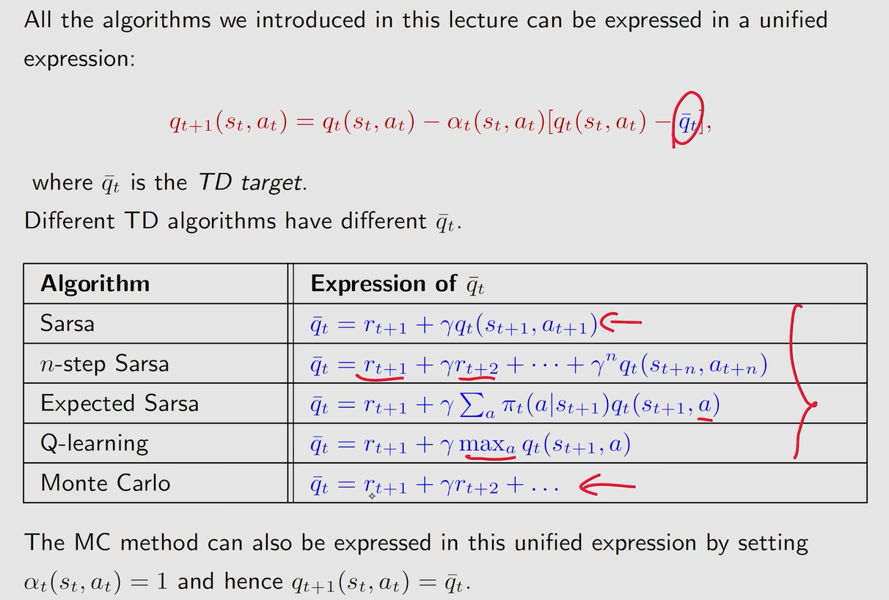

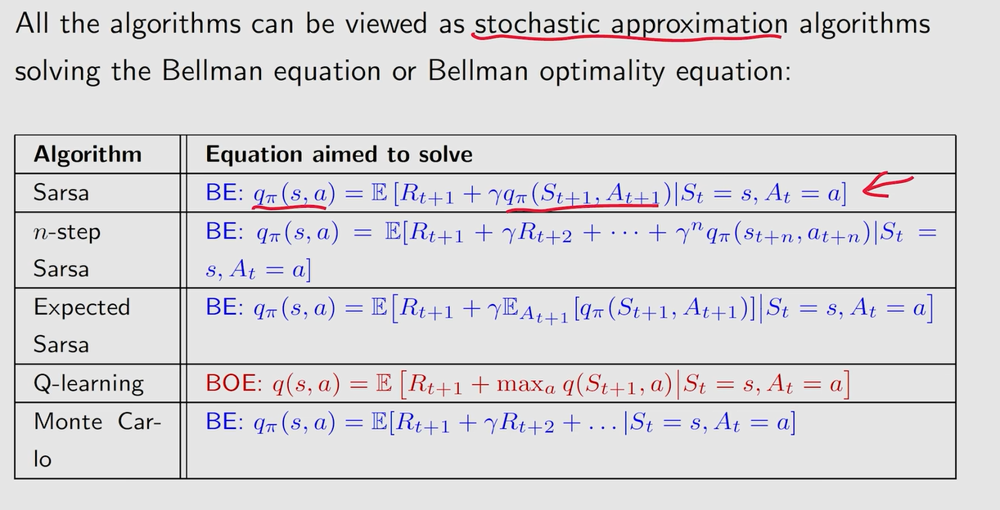
