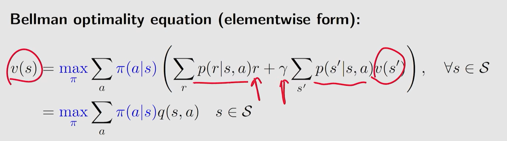
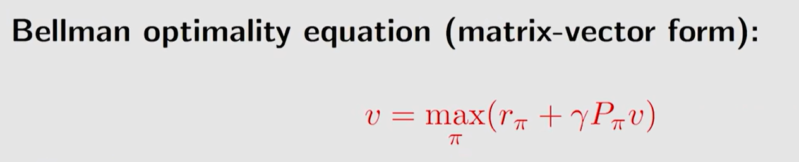
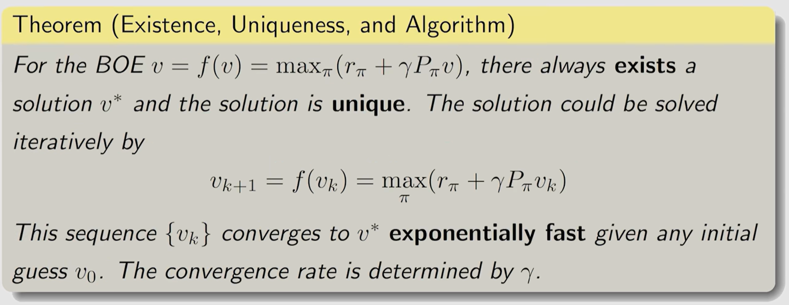
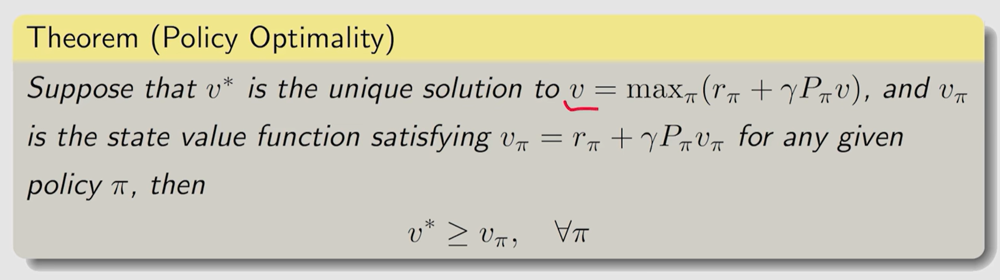
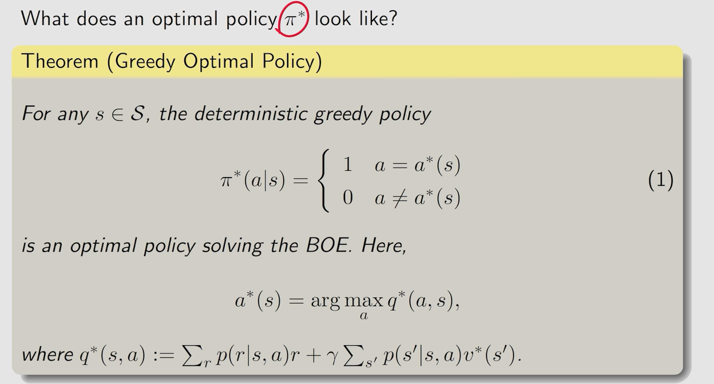
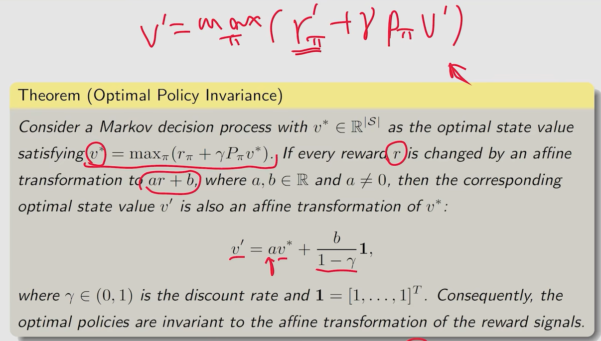

#### 第三课 bellman optimality equation(BOE)

bellman optimality equation只是在bellman equation前面加了max pai

等式右侧，对每个给定的v，都能找到使等式右侧取最大值的pai。因此可以将该等式看作v=f(v)形式。

可以用以下迭代算法求解BOE，得到唯一最优解state value，和与之对应的policy

注：该迭代算法被称为值迭代算法value iteration

得到的唯一最优解state value，是所有state value中最大的

最优策略是deterministic greedy policy

附录：线性改变reward，并不会影响最优策略

