#### 第九课 policy gradient

直接求解最优策略

通过计算所有state value/immediate reward value之和作为loss来评估策略的好坏，进而梯度上升优化策略。

策略函数可以任选。可直接选取神经网络。注意，在本章中还需要将神经网络对某一state的每个action的输出送入softmax中，最终作为策略函数的输出。这样就会使得策略是stochastic。

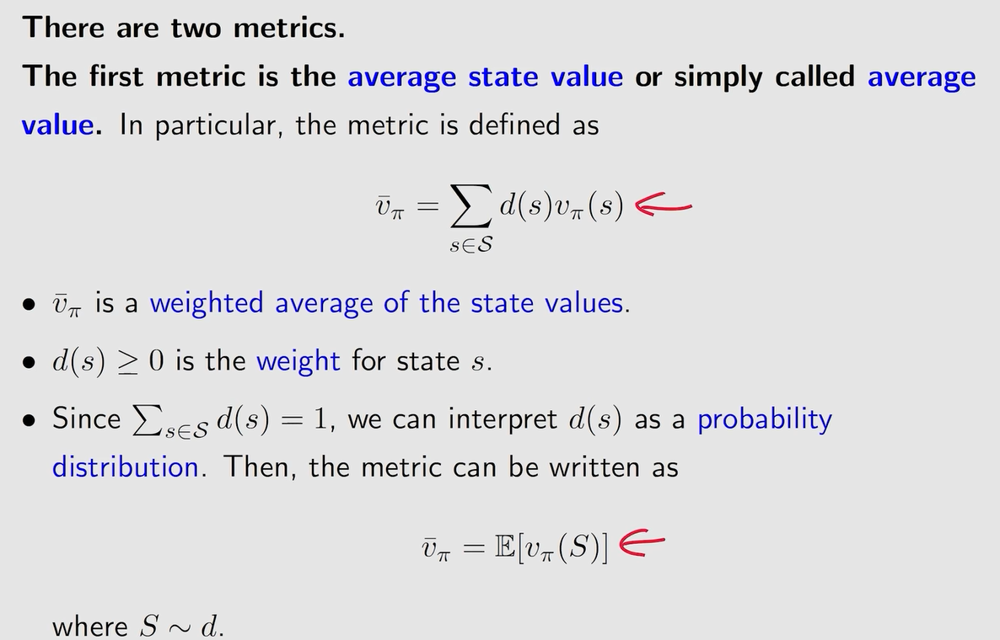

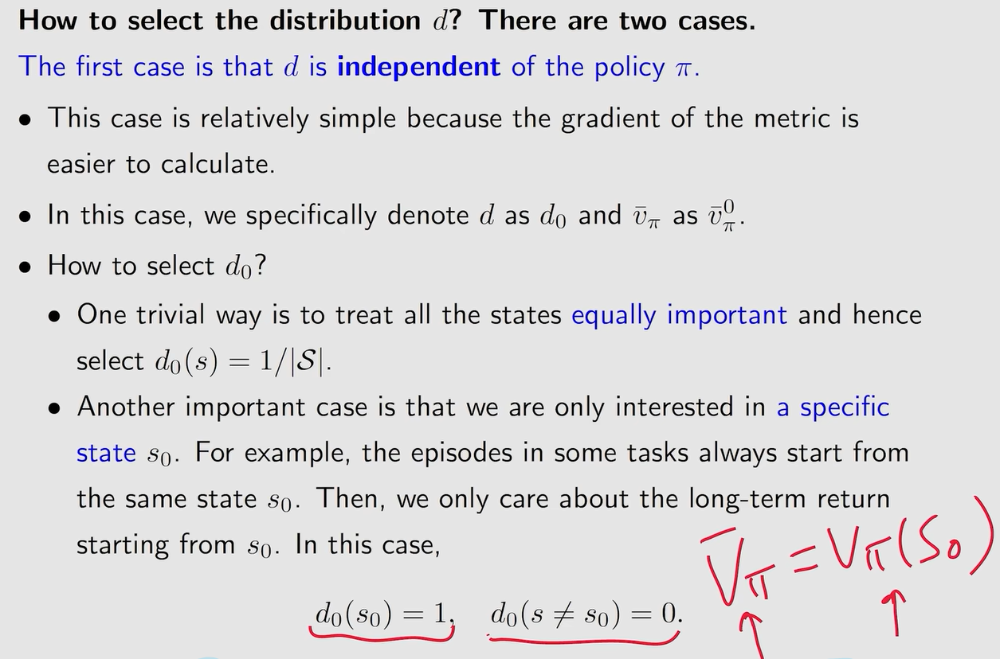

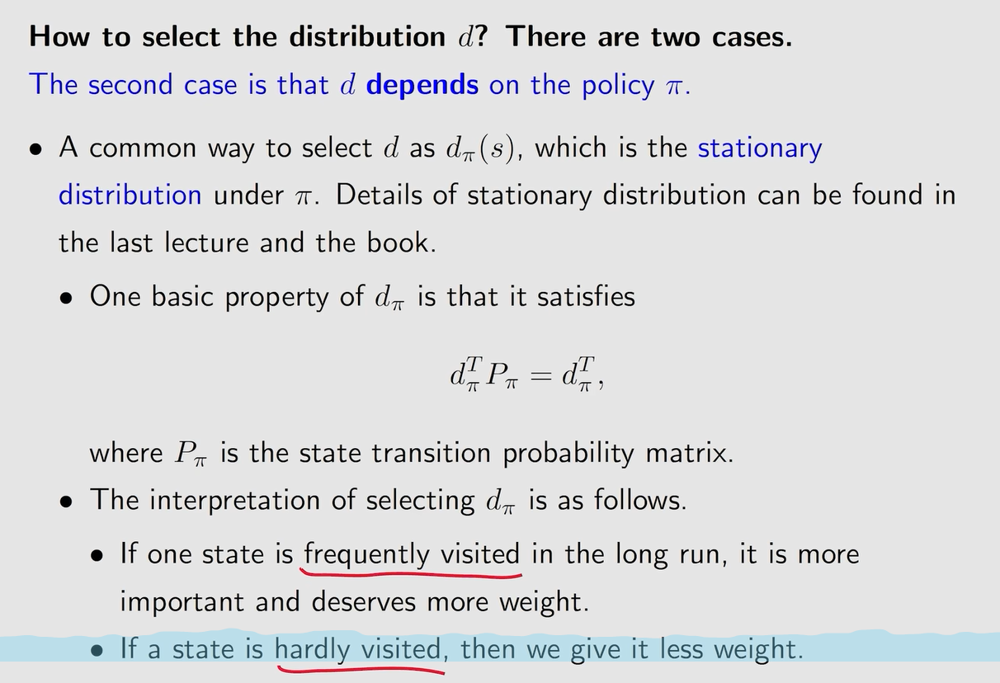

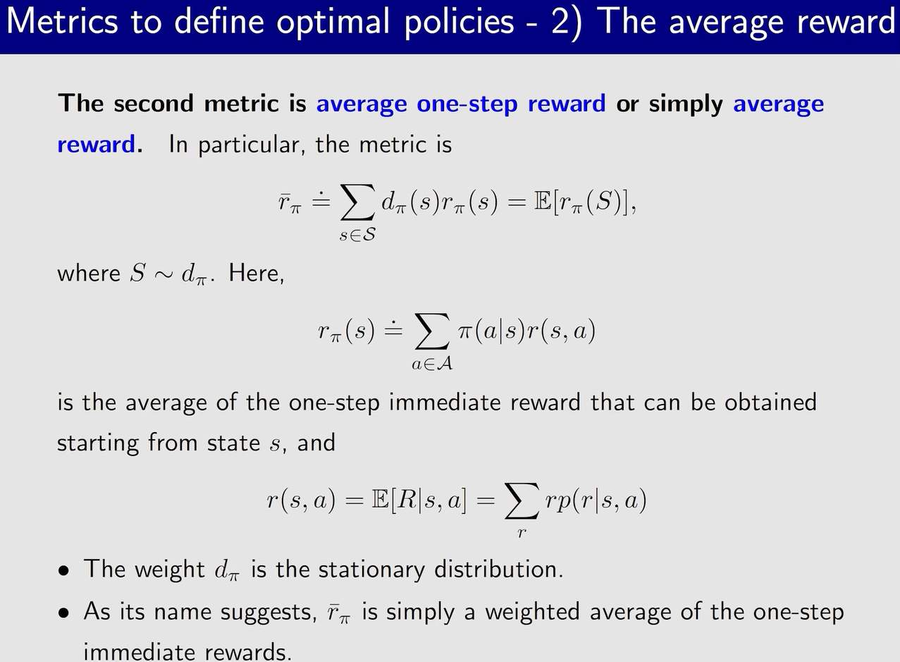

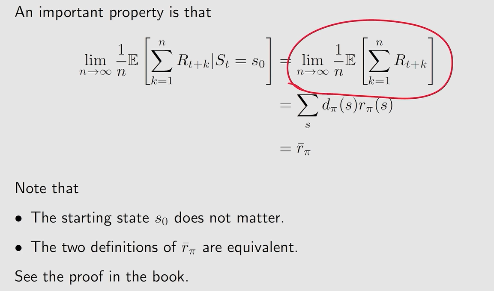

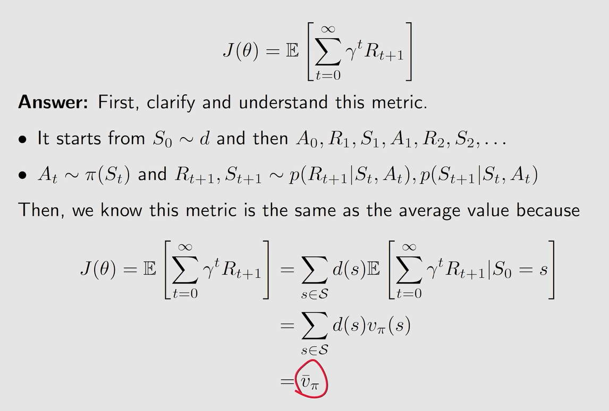

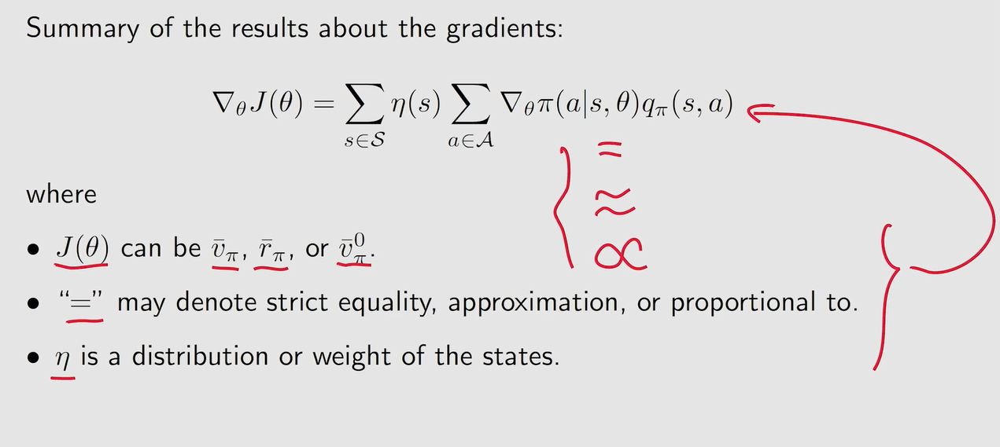

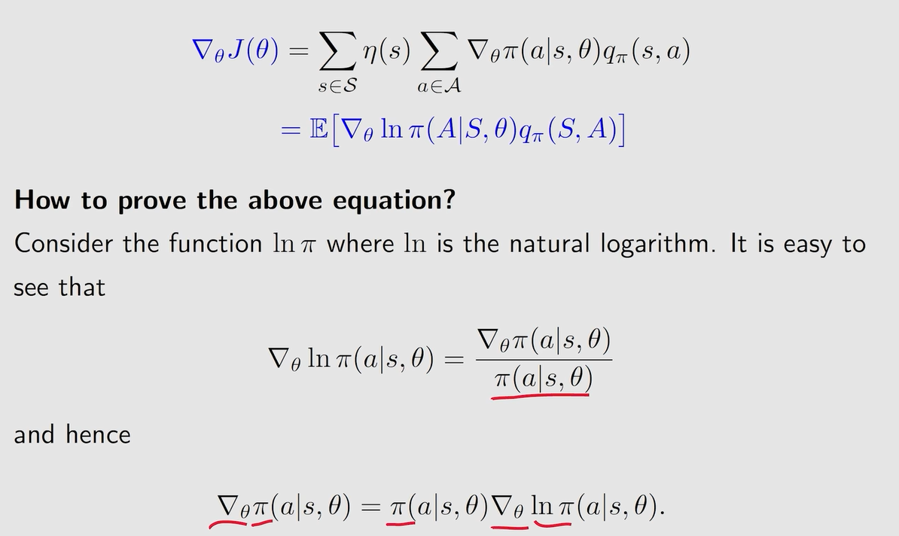

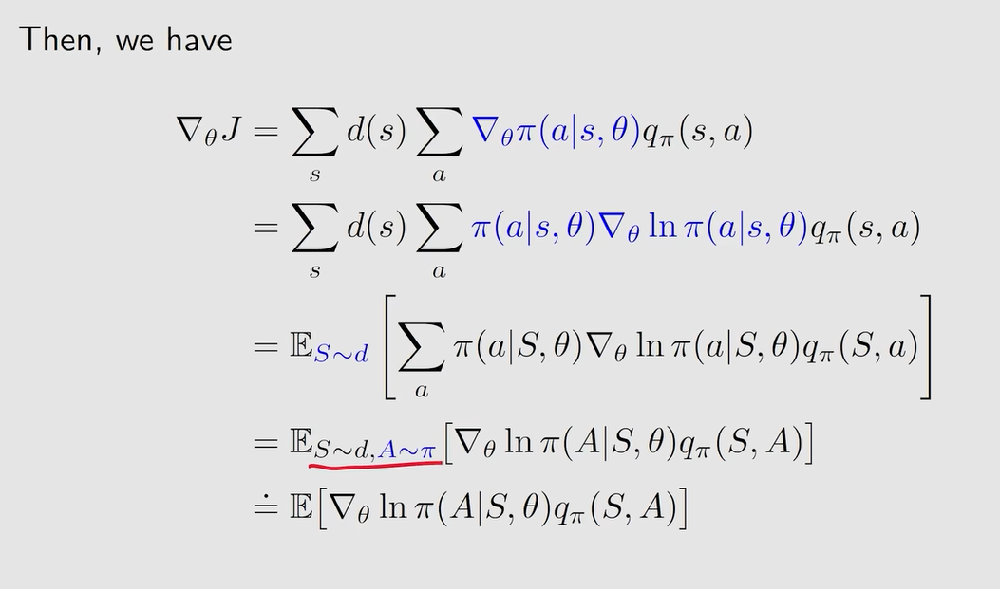

选取策略函数

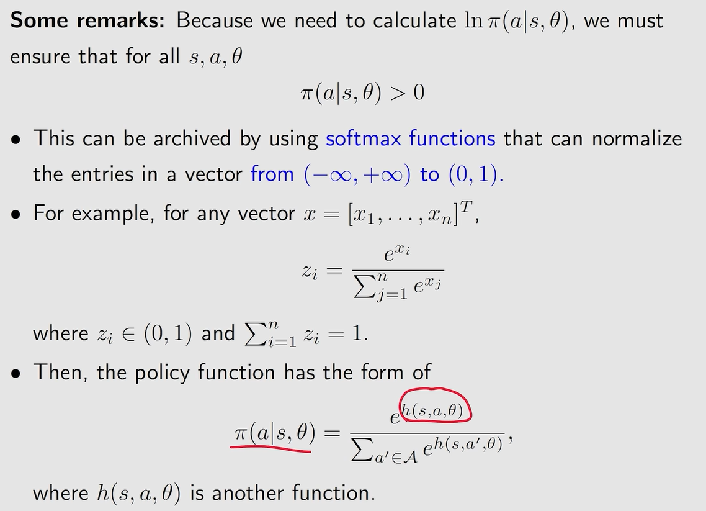

梯度上升求最优策略

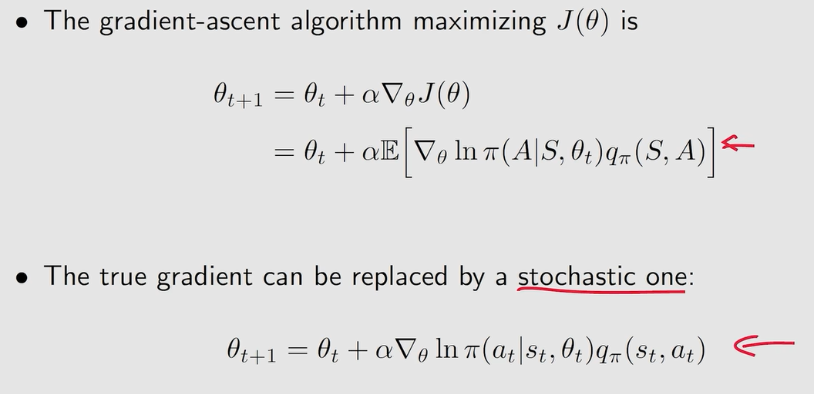

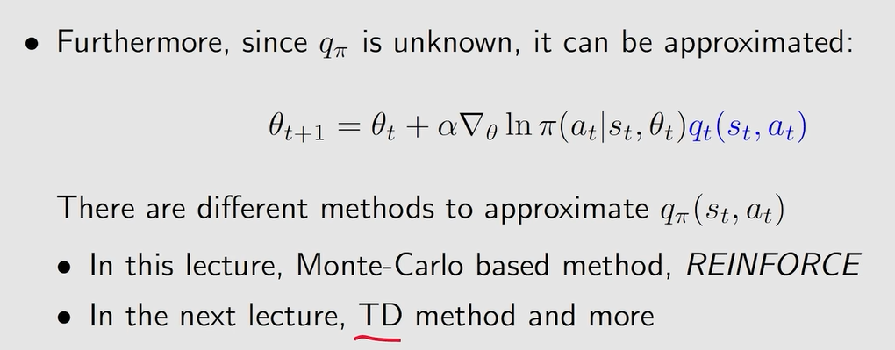

先估计action value，也即是评估策略，然后再更新策略

这里有个问题：到底按什么样的概率分布采样初始状态s0？ppt里并未说明

其实这里采样s0的概率分布，就对应了前面评估策略时，到底选用的是什么样的状态概率分布

方便理解的话，可以直接想象是等概率挑选所有状态

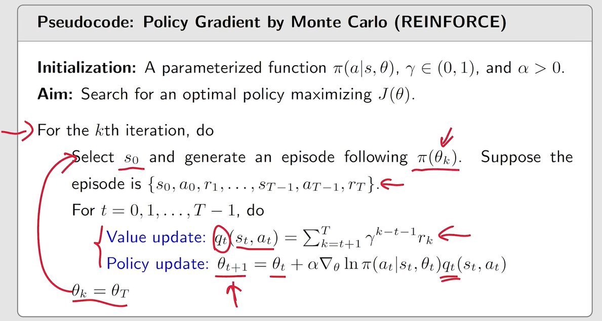
