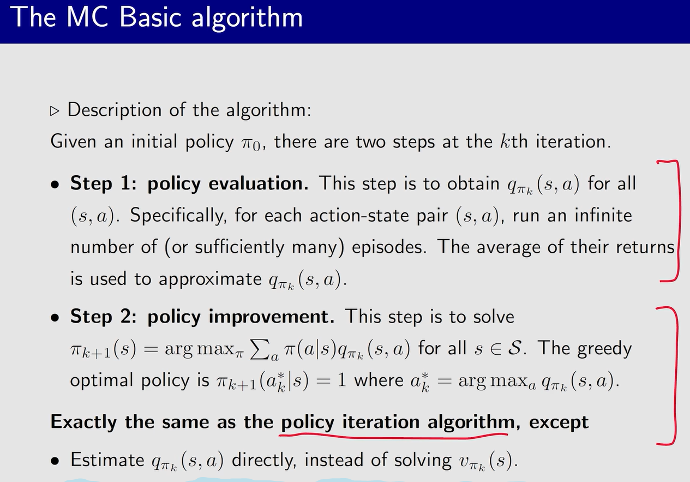
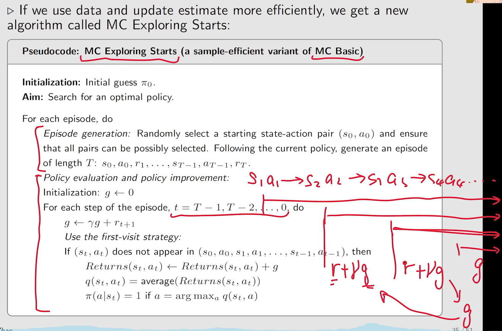
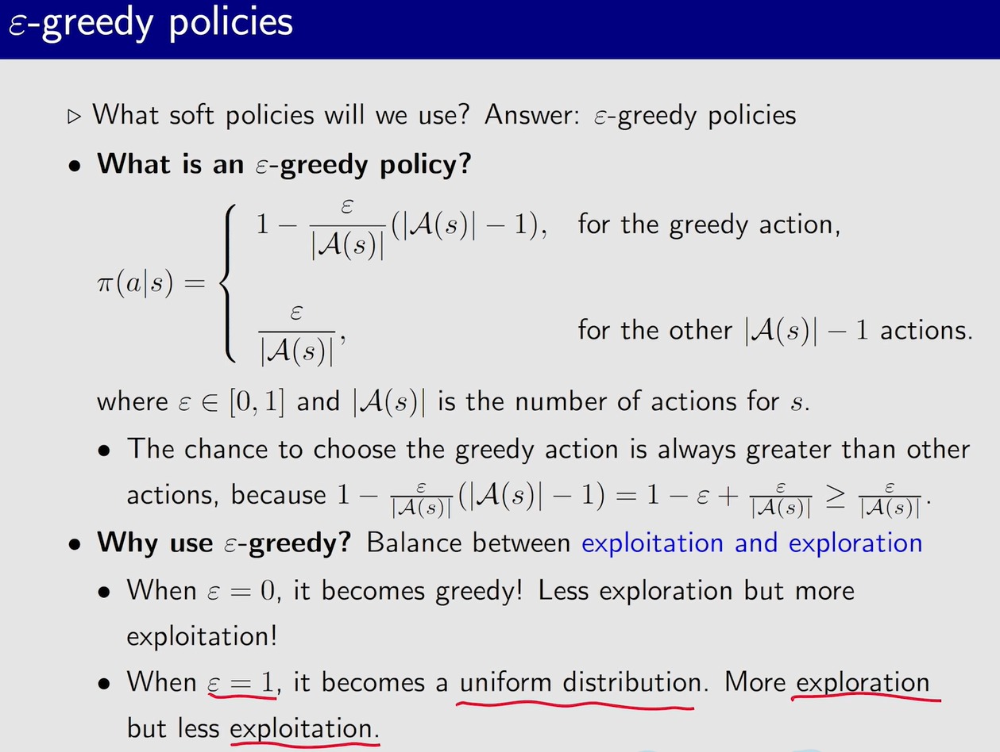
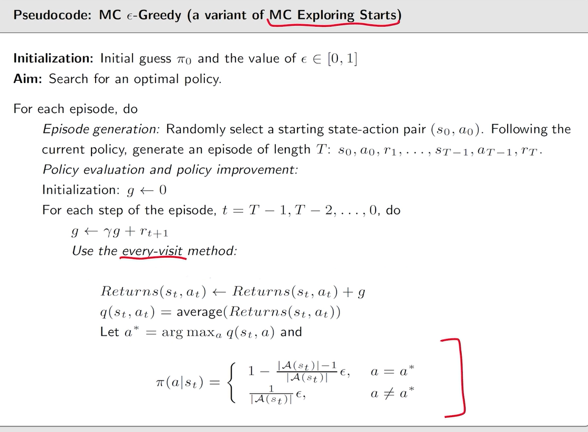

#### 第五课 monte carlo

model-free algorithm

1.Monte Carlo Basic

思路很简单，先随机给定一个初始的策略，然后根据这个策略，对每个(s,a)以它为出发点生成许多个episode，计算出discounted return，取平均作为action value。然后直接用这个action value更新策略。

2.MC Exploring Starts

主要有两点改进：

1. 在Monte Carlo Basic中，要收集完所有episode再更新action value。因此，我们收集完一个episode就直接更新action value。
2. 在Monte Carlo Basic中，收集一条episode却只更新episode开头的那一个(s,a)过于浪费数据。因此，我们将episode中经过的每个(s,a)，都把它们的discounted return作为样本估计它的action value

为了更新所有(s,a)，我们需要访问到所有(s,a)。访问有两种情况，start和visit。目前为止visit都只能根据策略访问，无法强制visit到所有(s,a)。因此我们只能在每个(s,a)上start一次episode，才能确保访问到所有(s,a)，而这也就是Exploring Starts的含义。

3.MC epsilon-greedy(without Exploring Starts)

相比MC Exploring Starts，MC epsilon-greedy只是把deterministic策略换成了epsilon-greedy策略。这样就能确保足够长的episode能visit到所有(s,a)，也就不需要Exploring Starts这个限制条件了。

这里和MC Exploring Starts稍有不同的是，使用的every visit method，因为每个episode会很长，需要充分利用

当step很长时，一个episode就能访问遍所有(s,a)

最初epsilon可以比较大增加随机性，之后要逐渐减小epsilon以得到最优策略
