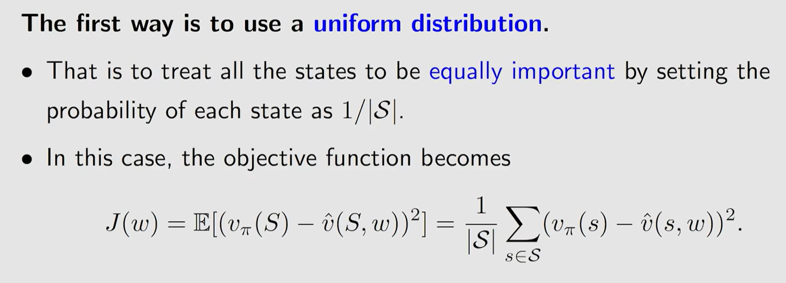
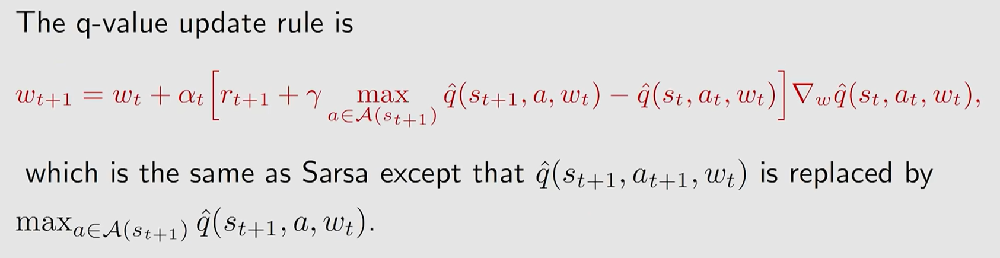

#### 第八课 value function approximation

1.objective function

问题是如何选择S的分布

2.optimization algorithm

value function的两种主要的选择，线性或者神经网络

线性value function的参数更新策略

注，这里用到了矩阵求导，如果没接触过可以参考李沐深度学习中的[一节课](https://www.bilibili.com/video/BV1eZ4y1w7PY "矩阵求导")

3.Sarsa+value function approximation

4.q-learning+value function approximation(不常用，很底层)

***

以上都是求解给定策略的state/action value function，下面我们要讨论直接求解最优策略对应的action value function

5.Deep Q-learning/Deep Q-network(DQN)

deep q-learning与tabular q-learning比较：

deep q-learning是对一个action value function做优化，而这一个action value function是建立在所有(s,a)状态之上，因此做优化时需要考虑(s,a)如何采样，也就是(s,a)的分布。在这里，我们使用experience replay是假设(s,a)为均匀分布。

tabular q-learning是针对每一个(s,a)求最优解，不需要考虑(s,a)之间的分布关系

