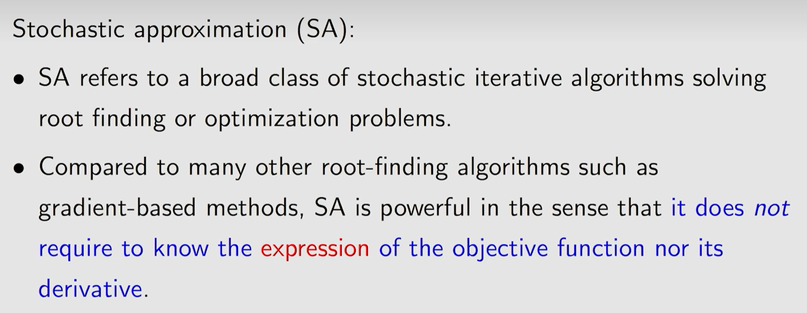
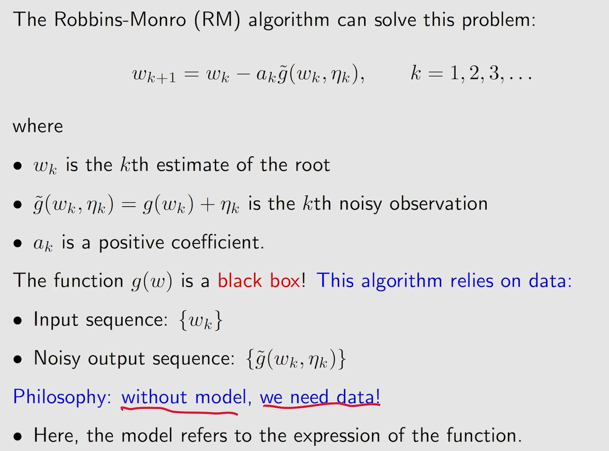
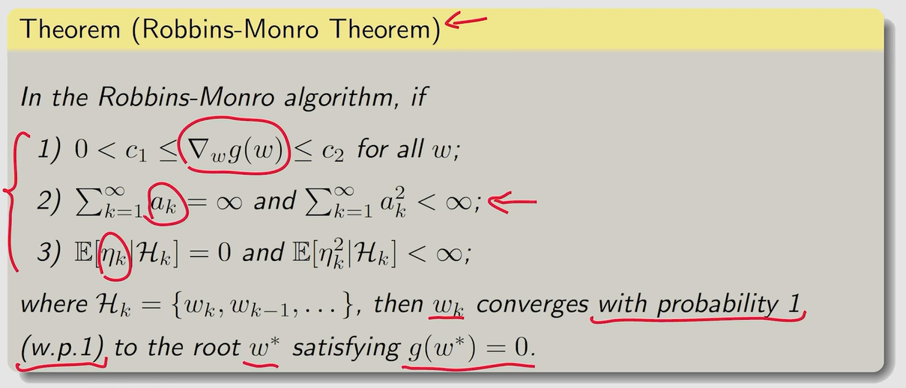

#### 第六课 stochastic approximation

1.stochastic approximation

2.Robbins-Monro algorithm

RM是SA领域里的开创性算法

目标：求解g(x)=0

收敛条件：

条件一要求函数单增

条件二要求ak收敛到0，且不能收敛的太快

例，ak=1/k满足条件二。实际中常会将ak设为一个非常小的正数。

可以证明，SGD算法就是特殊的RM算法。注，对于损失函数loss，我们的目标是求其导数为0的点，而使用该算法的条件是loss的二阶段大于0，也就是凸函数。
