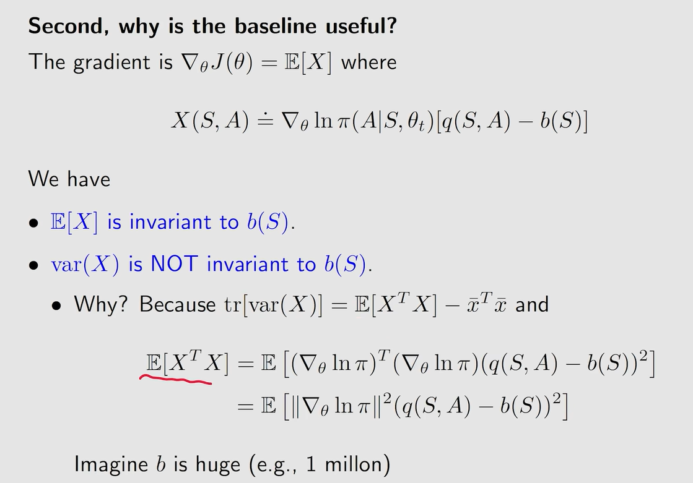
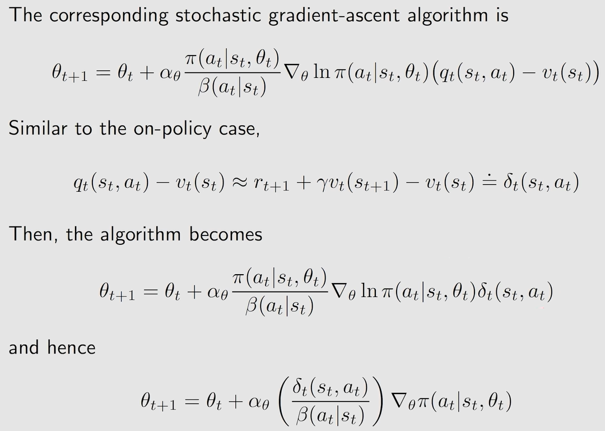

#### 第十课 actor critic

1.the simplest actor critic algorithm(QAC)

critic:sarsa+value function approximation

actor:policy update algorithm

2.advantage actor critic(A2C)

基本思想是引入baseline减小方差

先来个引理

引入baseline不会改变X的期望，但是会改变方差

这样，我们就可以通过修改baseline来减小X的方差

3.importance sampling

之前介绍的两种算法都是on policy，也就是基于待优化策略生成数据，评估策略，进而改进策略。这种方法的缺点在于不能使用其他策略事先生成好的数据。而importance sampling就可以将on policy改进为off policy

4.off policy actor critic

我们将基于beta策略下生成的数据，使用off policy的actor critic算法，算出最优策略

既然是基于beta策略下生成的数据，那么我们的loss函数中，原先基于不断更新的策略下的(s,a)的分布也就变为服从beta策略下(s,a)的分布

值得注意的是，这里loss函数对state value求和时取的分布是在beta策略上的分布

